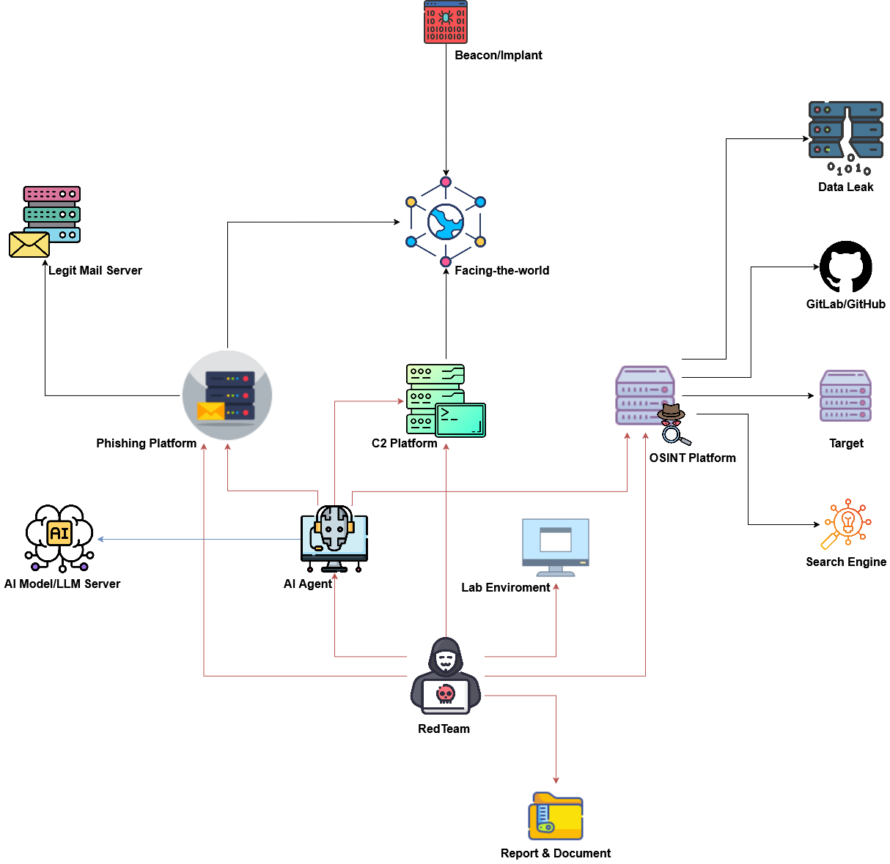

# Modern Red Team Infrastructure

A comprehensive modern architecture model is proposed to integrate platform solutions and tooling to support a professional Red Team.

## Report & Document

|Reference|Description|
|---|---|
|[Red Team GitLab Handbook](https://handbook.gitlab.com/handbook/security/security-operations/red-team/)|GitLab's open-source Red Team operations handbook covering methodology, processes, tooling, and best practices for conducting enterprise-level adversarial engagements.|
|[IBM Red teaming](https://www.ibm.com/think/topics/red-teaming)|IBM's overview of red teaming methodology, adversary simulation approaches, and how organizations can leverage offensive security testing to strengthen defenses.|
|[Red Team](https://redteam.io/)|Community-driven platform aggregating red team tools, techniques, resources, and knowledge sharing for offensive security professionals.|

## RedTeam

|Certificates/Courses|Description|
|---|---|
|[Red Team Ops I & II](https://www.zeropointsecurity.co.uk/course/red-team-ops)|In-depth hands-on course teaching advanced adversary simulation using Cobalt Strike, covering OPSEC-safe tradecraft, lateral movement, privilege escalation, and evasion techniques.|
|[BOF Development & Tradecraft](https://www.zeropointsecurity.co.uk/course/bof-dev)|Specialized course teaching Beacon Object File (BOF) development for Cobalt Strike, enabling custom in-memory capabilities without dropping artifacts to disk.|
|[OSCP+](https://www.offsec.com/courses/pen-200/)|OffSec's foundational penetration testing certification teaching practical exploitation, enumeration, privilege escalation, and report writing through hands-on lab environment.|
|[OSEP](https://www.offsec.com/courses/pen-300/)|Advanced evasion techniques and breaching defenses certification covering AV/EDR bypass, lateral movement in hardened environments, and custom payload development.|
|[OSWE](https://www.offsec.com/courses/web-300/)|Advanced web application security certification focusing on white-box code review, exploiting custom web applications, and developing proof-of-concept exploits.|
|[OSED](https://www.offsec.com/courses/exp-301/)|Windows exploit development certification teaching buffer overflows, shellcoding, reverse engineering, and advanced exploitation techniques on x86 and x64 architectures.|
|[OSEE](https://www.offsec.com/courses/exp-401/)|Expert-level exploit development course covering advanced Windows internals, kernel exploitation, sandbox escapes, and cutting-edge offensive research techniques.|
|[Malware Development Course](https://maldevacademy.com/maldev-course)|Comprehensive course teaching malware creation from scratch using C/C++, covering process injection, EDR evasion, custom loaders, shellcode execution, and obfuscation.|
|[Ransomware Internals, Simulation & Detection Course](https://maldevacademy.com/ransomware-course)|Deep dive into ransomware mechanics, encryption techniques, propagation methods, and how to safely simulate ransomware operations for red team exercises.|
|[Offensive Phishing Operations Course](https://maldevacademy.com/phishing-course)|Practical course on planning and executing sophisticated phishing campaigns, including infrastructure setup, payload development, and credential harvesting techniques.|
|[Modern Initial Access and Evasion Tactics](https://binary-offensive.com/initial-access-training)|Course covering contemporary initial access vectors, living-off-the-land techniques, AMSI/ETW bypasses, and blending into target environments undetected.|
|[Red Teaming (TryHackMe)](https://tryhackme.com/path/outline/redteaming)|Interactive learning path covering red team fundamentals, network exploitation, Active Directory attacks, C2 frameworks, and adversarial emulation methodologies.|
|[Phishlet Developer Masterclass](https://www.simplerhacking.com/courses/phishlet-creation-masterclass)|Hands-on course teaching how to create custom Evilginx phishlets for various web applications to bypass MFA through man-in-the-middle session hijacking.|
|[EvilGoPhish Mastery](https://www.simplerhacking.com/courses/evilgophish-masterclass-course)|Complete guide to deploying and operating EvilGoPhish combining GoPhish's campaign management with Evilginx's MFA bypass capabilities.|
|[Evilginx Professional Masterclass](https://www.simplerhacking.com/courses/evilginx-course)|Professional-level course on Evilginx deployment, infrastructure hardening, phishlet customization, and executing advanced credential harvesting operations.|

## AI Agent

|AI Agent|Description|
|---|---|
|[Cursor](https://cursor.com/)|AI-powered code editor with contextual code generation, intelligent autocomplete, and natural language editing capabilities for accelerated exploit/tool development.|
|[Claude](https://claude.ai)|Anthropic's advanced AI assistant capable of analyzing code, explaining complex security concepts, and assisting with threat modeling and documentation.|
|[Windsurf](https://windsurfrs.com/)|AI coding assistant designed for collaborative programming with real-time suggestions, code understanding, and multi-language support.|
|[Antigravity](https://antigravity.ai/)|AI agent specialized in software development workflows, offering intelligent code completion, refactoring suggestions, and automated testing capabilities.|
|[Continue.dev](https://continue.dev/)|Open-source AI code assistant supporting multiple LLMs, enabling autocomplete, code explanation, and customizable prompts directly in your IDE.|

## AI Model/LLM Server

|LLM Server|Description|
|---|---|
|[OpenAI](https://openai.com/)|Leading AI research organization providing GPT models through API for natural language processing, code generation, and complex reasoning tasks.|
|[huggingface](https://huggingface.co/)|Open platform hosting thousands of pre-trained models, datasets, and tools for NLP, computer vision, and machine learning experimentation.|
|[DeepTeam](https://www.trydeepteam.com/)|AI-powered platform specialized for security teams, offering threat intelligence analysis, report generation, and collaborative security research capabilities.|

## OSINT Platform

|OSINT Platform|Description|
|---|---|
|[rengine](https://github.com/yogeshojha/rengine)|Automated reconnaissance framework with GPT-powered vulnerability analysis, continuous monitoring, subdomain discovery, endpoint extraction, and comprehensive reporting.|
|[bbot](https://github.com/blacklanternsecurity/bbot)|Recursive OSINT automation tool finding 20-50% more subdomains through AI/NLP-powered mutations, passive API enumeration, and intelligent DNS brute-forcing.|

## Data Leak

|Data Leak|Description|
|---|---|
|[Group-IB](https://www.group-ib.com/)|Search engine for identifying exposed databases, credentials, and sensitive information from historical breaches for threat intelligence and exposure assessment.|
|[IntelX](https://intelx.io/)|Search engine for identifying exposed databases, credentials, and sensitive information from historical breaches for threat intelligence and exposure assessment.|

## Search Engine

|Search Engine|Description|
|---|---|
|[Shodan](https://www.shodan.io/)|Internet-wide scanner indexing exposed devices, services, and vulnerabilities across global IP space for attack surface discovery and threat intelligence.|
|[ZoomEye](https://www.zoomeye.ai/)|Cyberspace search engine providing device fingerprinting, service detection, and vulnerability mapping across internet-connected systems.|
|[Censys](https://censys.io/)|Internet scanning platform offering comprehensive visibility into exposed assets, certificates, and infrastructure for attack surface management.|
|[ViewDNS.info](https://viewdns.info/)|Collection of DNS and networking tools providing reverse IP lookup, DNS records, port scanning, and historical DNS data.|
|[DNSDumpster](https://dnsdumpster.com/)|Free domain research tool for discovering DNS records, subdomains, and mapping organizational infrastructure through passive reconnaissance.|
|[Sourcegraph](https://sourcegraph.com/)|Universal code search engine enabling rapid discovery of code patterns, vulnerabilities, and sensitive data across public and private repositories.|
|[Hunter.io](https://hunter.io/)|Email discovery and verification platform for finding corporate email addresses, patterns, and organizational contacts for social engineering research.|

## C2 Platform

|C2 Platform|Description|
|---|---|
|[Cobalt Strike](https://www.cobaltstrike.com/)|Industry-standard commercial C2 framework with malleable profiles, Beacon payload, post-exploitation modules, process injection, and team collaboration for red team operations.|
|[BruteRatel](https://bruteratel.com/)|Advanced C2 framework with userland hook removal, sleep masking, customizable communication channels, and superior EDR evasion designed for professional red teams.|
|[Loki](https://github.com/boku7/Loki)|Lightweight open-source C2 framework emphasizing simplicity and OPSEC-safe design for covert command and control operations.|
|[Sliver](https://github.com/BishopFox/sliver)|Cross-platform open-source C2 by Bishop Fox supporting mTLS/WireGuard/HTTP/DNS, dynamic code generation, multiplayer mode, and compile-time obfuscation.|
|[MythicAgents](https://github.com/MythicAgents/Mythic)|Collaborative multi-platform C2 with plug-and-play agent architecture, containerized microservices, flexible communication profiles, and browser-based team interface.|
|[Havoc](https://github.com/HavocFramework/Havoc)|Modern open-source C2 alternative to Cobalt Strike featuring Demon agents, indirect syscalls, sleep obfuscation, and modular payload design for evasion.|
|[Nimhawk](https://github.com/hdbreaker/Nimhawk)|Stealthy C2 framework written in Nim language offering native speed, small payload sizes, and cross-platform capabilities for red team engagements.|
|[Specter Insight](https://practicalsecurityanalytics.com/specterinsight/)|C2 platform combining offensive operations with analytics-driven approach to adversary emulation and security validation.|

## Facing-the-world

|Facing-the-world|Description|
|---|---|
|[BounceBack](https://github.com/D00Movenok/BounceBack)|Highly configurable reverse proxy/redirector with WAF functionality, traffic filtering, malleable C2 validation, and domain fronting to shield C2 infrastructure.|
|[C3](https://github.com/ReversecLabs/C3)|Custom Command and Control framework enabling creation of resilient, decentralized C2 channels through various interconnected relay mechanisms.|

## Phishing Platform

|Phishing Platform|Description|
|---|---|
|[Evilginx Pro](https://evilginx.com/)|Commercial version of Evilginx offering advanced reverse-proxy phishing with session token stealing to bypass MFA, including premium support and additional features.|
|[Evilginx 3.0](https://github.com/kgretzky/evilginx2)|Open-source man-in-the-middle attack framework transparently proxying authentication flows to capture credentials and session cookies, defeating 2FA/MFA protections.|
|[Gophish](https://getgophish.com/)|Open-source phishing simulation platform with campaign management, email template customization, landing pages, real-time analytics, and REST API for security awareness training.|
|[EvilGoPhish](https://github.com/evilgophish/evilgophish)|Integration combining Gophish's campaign management with Evilginx's MFA bypass capabilities for sophisticated phishing simulations.|

## Legit Mail Server

|Legit Mail Server|Description|
|---|---|
|[GoDaddy Email](https://www.godaddy.com/vi-vn/email)|Professional email hosting service providing legitimate SMTP infrastructure for phishing campaigns requiring reputable sender domains.|
|[Mailgun](https://www.mailgun.com/)|Transactional email API service offering programmatic email delivery, tracking, and delivery optimization for large-scale phishing campaigns.|
|[SendGrid](https://sendgrid.com/)|Cloud-based email delivery platform with high deliverability rates, detailed analytics, and API access for automating phishing operations.|

## Beacon/Implant

|Repo/Tool|Description|
|---|---|
|[Rust for malware Development](https://github.com/Whitecat18/Rust-for-Malware-Development)|Educational repository teaching Rust-based implant development leveraging memory safety, low-level control, and cross-compilation for modern red team operations.|
|[ChromElevator (Chrome App-Bound Encryption Decryption)](https://github.com/Whitecat18/ChromElevator)|Tool for bypassing Chrome's App-Bound Encryption to extract cookies, credentials, and sensitive data from Chromium-based browsers for post-exploitation.|
|[EvilBytecode](https://github.com/EvilBytecode)|Collection of malware development projects, PoCs, and offensive security tools demonstrating various implant techniques and evasion methods.|
|[OffensiveCpp](https://github.com/lsecqt/OffensiveCpp)|Curated collection of C++ offensive security projects including process injection, EDR bypass, shellcode loaders, and exploitation techniques.|
|[OffensiveGo](https://github.com/lsecqt/OffensiveGo)|Repository of offensive Golang projects for implant development, infrastructure tooling, and cross-platform exploitation utilities.|
|[OffensiveRust](https://github.com/lsecqt/OffensiveRust)|Collection of Rust-based offensive security tools demonstrating system-level programming for malware development and post-exploitation.|
|[SharpCollection](https://github.com/Flangvik/SharpCollection)|Pre-compiled .NET assembly collection for red team operations including privilege escalation, lateral movement, and Active Directory exploitation.|
|[UnProtect](https://unprotect.it/)|Comprehensive malware evasion techniques database documenting anti-analysis, anti-debugging, and EDR/AV bypass methods with classification and PoCs.|
|[DumpChromeSecrets](https://github.com/Maldev-Academy/DumpChromeSecrets)|Tool for extracting Chrome's App-Bound Encryption to extract cookies, credentials, and sensitive data from Chromium-based browsers for post-exploitation.|

